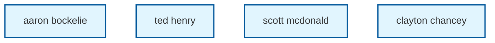

# Atlassian Relationship Map

Generated on: 2025-07-14T21:43:42.759Z
Site: cprimeglobalsolutions
Entities: 4
Relationships: 0

## Relationship Diagram

## Entity Details

| Name | Type | URL |
|------|------|-----|
| aaron bockelie | user |  |
| ted henry | user |  |
| scott mcdonald | user |  |
| clayton chancey | user |  |

## Relationship Details

| From | Relationship | To |
|------|--------------|----|

---
*Generated by Atlassian GraphQL MCP Server*
